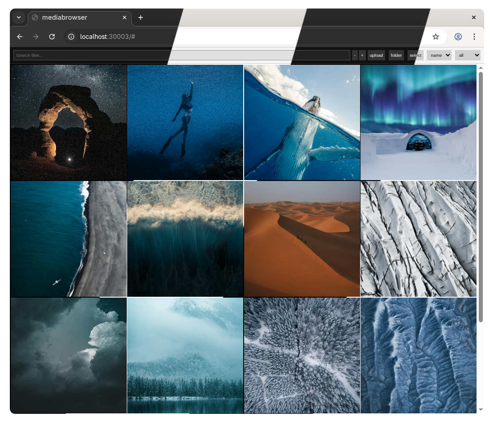

<h3 align="center">
    A simple, lightweight web-based file browser
</h3>

<div align="center">
	
</div>

## Features

- **Dual server architecture** - Runs two separate servers for different use cases
- **Apache-style HTTP file serving** - Pure httpd server on port 30002, compatible with standard tools
- **Enhanced UI** - Modern file browser on port 30003 with advanced features
- **Upload support** - Upload files up to 256GB
- **ZIP downloads** - Download multiple files and directories as ZIP archives
- **File management** - Create folders, delete files, edit text files
- **Mobile-friendly** - Works on phones and tablets

## Usage

### Direct Execution

```bash
cargo run
```

The application runs **two separate servers** with **identical URL structures**:

- **Port 30003** - Enhanced UI: `http://localhost:30003/`
  - Full-featured web interface with uploads, downloads, and file management
  - Uses the same URL paths as the httpd server for seamless navigation
  - Examples:
    - `http://localhost:30003/` - Root directory
    - `http://localhost:30003/folder/` - Browse folder
    - `http://localhost:30003/folder/file.mp4` - View/play file in UI

- **Port 30002** - Apache httpd: `http://localhost:30002/`
  - Pure Apache-style file server
  - Compatible with PhotoChiotte and other httpd clients
  - Standard directory listings with no modifications
  - Examples:
    - `http://localhost:30002/` - Root directory listing
    - `http://localhost:30002/folder/` - Folder listing
    - `http://localhost:30002/folder/file.mp4` - Direct file download

### Docker (Development)

```bash
docker-compose --profile dev up
```

### Docker (Production)

```bash
docker-compose --profile pro up
```

### Docker (oneline)
```bash
docker image inspect mediabrowser >/dev/null 2>&1 || docker build -t mediabrowser https://github.com/iruzo/mediabrowser.git && docker run -p 30003:30003 -v $(pwd)/data:/data mediabrowser
```
```bash
sudo docker image inspect mediabrowser >/dev/null 2>&1 || sudo docker build -t mediabrowser https://github.com/iruzo/mediabrowser.git && sudo docker run -p 30003:30003 -v $(pwd)/data:/data mediabrowser
```

### Environment Variables

```bash
# Set log level (optional)
export RUST_LOG=debug

# Custom data directory (optional, defaults to /data)
export DATA_DIR=/path/to/your/files
```

## API Endpoints

### Enhanced UI Server (Port 30003)
- `GET /` - Web interface
- `GET /styles.css` - UI stylesheet
- `GET /script.js` - UI JavaScript
- `GET /api/list?path=/data` - JSON directory listing with metadata
- `POST /api/upload?path=/data` - Upload files (multipart form, 256GB limit)
- `GET /api/download-multiple?paths=/data/file1,/data/file2` - Download as ZIP
- `DELETE /api/delete?path=/data/file` - Delete file/directory
- `POST /api/mkdir?path=/data/newfolder` - Create directory
- `POST /api/save?path=/data/file.txt` - Save text file content

### Apache httpd Server (Port 30002)
- `GET /` - Apache-style directory listing (root)
- `GET /path/to/file` - Direct file access
- `GET /path/to/dir/` - Apache-style directory listing

Both servers support CORS for cross-origin requests.
