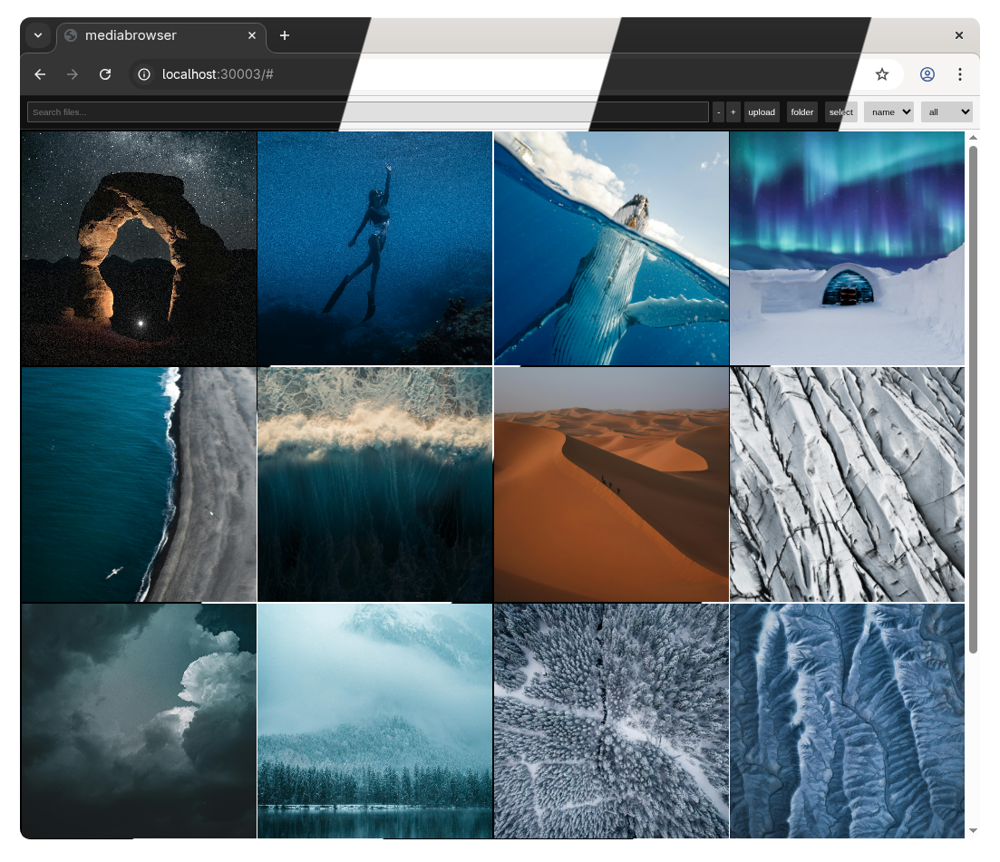

<h3 align="center">
    A simple, lightweight web-based file browser
</h3>

<div align="center">
	
</div>

## Features

- **Apache-style HTTP file serving** - Pure httpd server at root path, compatible with standard tools
- **Enhanced UI** - Simple file browser at `/ui`
- **Upload support** - Upload files up to 256GB
- **TAR downloads** - Download multiple files and directories as TAR
- **File management** - Create folders, delete, modify and upload files
- **File preview** - View images, videos, audio, and text files

## Usage

### Direct Execution

```bash
cargo run
```

The application runs on **port 30003** with:

- **UI at `/ui`**: `http://localhost:30003/ui`
  - Examples:
    - `http://localhost:30003/ui/` - Root directory in UI
    - `http://localhost:30003/ui/folder/` - Browse folder in UI
    - `http://localhost:30003/ui/folder/file.mp4` - View/play file in UI

- **Apache like httpd at root**: `http://localhost:30003/`
  - Examples:
    - `http://localhost:30003/` - Root directory listing
    - `http://localhost:30003/folder/` - Folder listing
    - `http://localhost:30003/folder/file.mp4` - Direct file access

### Docker (Development)

```bash
docker-compose --profile dev up
```

### Docker (Production)

```bash
docker-compose --profile pro up
```

### Docker (oneline)
```bash
docker image inspect mediabrowser >/dev/null 2>&1 || docker build -t mediabrowser https://github.com/iruzo/mediabrowser.git && docker run -p 30003:30003 -e BIND_ADDR=0.0.0.0 -v $(pwd)/data:/data mediabrowser
```
```bash
sudo docker image inspect mediabrowser >/dev/null 2>&1 || sudo docker build -t mediabrowser https://github.com/iruzo/mediabrowser.git && sudo docker run -p 30003:30003 -e BIND_ADDR=0.0.0.0 -v $(pwd)/data:/data mediabrowser
```

### Environment Variables

```bash
# Set log level (optional)
export RUST_LOG=debug

# Custom data directory (optional, defaults to /data)
export DATA_DIR=/path/to/your/files

# Bind address (optional, defaults to 127.0.0.1)
# Use 0.0.0.0 to expose to other devices in the network
export BIND_ADDR=127.0.0.1

# Port (optional, defaults to 30003)
export PORT=30003
```

## API Endpoints

### UI Routes
- `GET /ui` - Web interface
- `GET /ui/*` - UI assets and client-side routes

### API Routes
- `POST /api/upload?path=/data` - Upload files (multipart form, 256GB limit)
- `GET /api/download-multiple?paths=/data/file1,/data/file2` - Download as TAR
- `DELETE /api/delete?path=/data/file` - Delete file/directory
- `POST /api/mkdir?path=/data/newfolder` - Create directory
- `POST /api/move?from=/data/old&to=/data/new` - Move file or directory
- `GET /api/download?path=/data/file` - Download single file

### Apache httpd Routes (Root)
- `GET /` - Apache-style directory listing (root)
- `GET /path/to/file` - Direct file access
- `GET /path/to/dir/` - Apache-style directory listing
