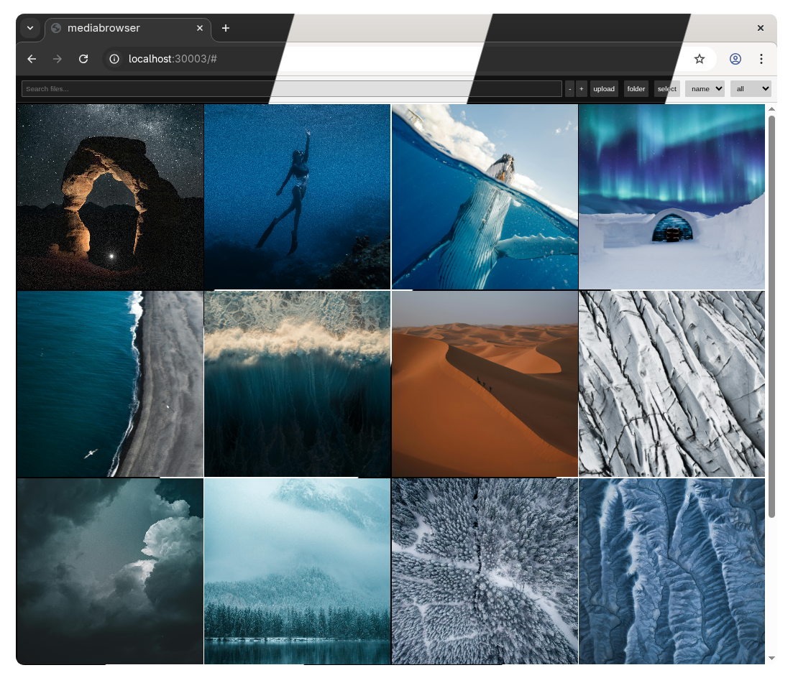

<h3 align="center">
    A simple, lightweight file server
</h3>

<div align="center">
	
</div>

## Features

- **Apache-style HTTP file serving** - Pure httpd server at root path, compatible with standard tools
- **Upload support** - Upload files up to 256GB
- **TAR downloads** - Download multiple files and directories as TAR
- **File management** - Create folders, copy, move, delete, modify and upload files
- **Recursive search** - Search files and directories recursively from any path
- **Lazy media browser** - Browse directory grids without loading off-screen images

## Usage

### Direct Execution

```bash
cargo run
```

The default build includes the API and UI and exposes all routes described
below. To run only the HTTP file server, without `/api` or `/ui`:

```bash
cargo run --no-default-features
```

The application runs on **port 30003** with:

- **Apache like httpd at root**: `http://localhost:30003/`
  - Examples:
    - `http://localhost:30003/` - Root directory listing
    - `http://localhost:30003/folder/` - Folder listing
    - `http://localhost:30003/folder/file.mp4` - Direct file access
- **Media browser under `/ui/`**: `http://localhost:30003/ui/`
  - `http://localhost:30003/ui/folder/` browses the same directory as
    `http://localhost:30003/folder/`
  - `http://localhost:30003/ui/folder/file.mp4` opens the same file as
    `http://localhost:30003/folder/file.mp4` in the media viewer

### Docker (Development)

```bash
docker-compose --profile dev up
```

### Docker (Production)

```bash
docker-compose --profile pro up
```

### Docker (HTTPD only)

```bash
docker build --file containers/httpd.Dockerfile --tag mediabrowser-httpd .
```

### Docker (oneline)
```bash
docker image inspect mediabrowser >/dev/null 2>&1 || docker build -t mediabrowser https://github.com/iruzo/mediabrowser.git && docker run -p 30003:30003 -e BIND_ADDR=0.0.0.0 -v $(pwd)/data:/data mediabrowser
```
```bash
sudo docker image inspect mediabrowser >/dev/null 2>&1 || sudo docker build -t mediabrowser https://github.com/iruzo/mediabrowser.git && sudo docker run -p 30003:30003 -e BIND_ADDR=0.0.0.0 -v $(pwd)/data:/data mediabrowser
```

### Environment Variables

```bash
# Set log level (optional)
export RUST_LOG=debug

# Custom data directory (optional, defaults to /data)
export DATA_DIR=/path/to/your/files

# Bind address (optional, defaults to 127.0.0.1)
# Use 0.0.0.0 to expose to other devices in the network
export BIND_ADDR=127.0.0.1

# Port (optional, defaults to 30003)
export PORT=30003
```

## API Endpoints

Each endpoint is documented with a curl example in
[doc/endpoints/](./doc/endpoints/).

### API Routes
- `GET /api/find?path=folder&query=name&type=dir&recursive=false` - List or search paths; directories end with `/`, `type` accepts `dir`, `file`, or `all`, recursion defaults to enabled, and `metadata=true` includes size, modified time, and media kind
- `POST /api/upload` - Upload files using multipart `path` and `file` fields (256GB limit)
- `POST /api/download` - Download selected paths using repeated URL-encoded `path` fields; a single file is sent as-is, anything else as TAR
- `POST /api/rm` - Remove a file or directory using a URL-encoded `path` field
- `POST /api/mkdir` - Recursively create a directory using a URL-encoded `path` field
- `POST /api/write` - Create or replace a UTF-8 text file using URL-encoded `path` and `content` fields
- `POST /api/mv` - Move one path using URL-encoded `from` and `to` fields
- `POST /api/cp` - Copy one file or directory using URL-encoded `from` and `to` fields

### Apache httpd Routes (Root)
- `GET /` - Apache-style directory listing (root)
- `GET /path/to/file` - Direct file access
- `GET /path/to/dir/` - Apache-style directory listing

`DATA_DIR` is the trusted filesystem anchor. Symbolic links below it are hidden
from listings and searches.
Direct paths to a link, or through one, behave as missing paths. Recursive copy
and download skip links; moving or removing a real directory may move or remove
link entries contained by that directory, but their targets are never followed.

### UI Routes
- `GET /ui/` - Client-rendered media browser for the data root
- `GET /ui/path/to/dir/` - Client-rendered media browser scoped to the matching HTTPD directory
- `GET /ui/path/to/media` - Open an image, video, or audio file in the media viewer

UI directory paths end with `/`. A missing trailing slash on a directory is
redirected to its canonical UI path. Files the viewer does not support are
redirected to the same path under the root HTTPD endpoint.

The UI response is stored and served as gzip. Browsers negotiate this
automatically. Other clients can request and decompress it with:

```bash
curl --compressed http://localhost:30003/ui/
```

A client that explicitly rejects gzip receives `406 Not Acceptable`.
