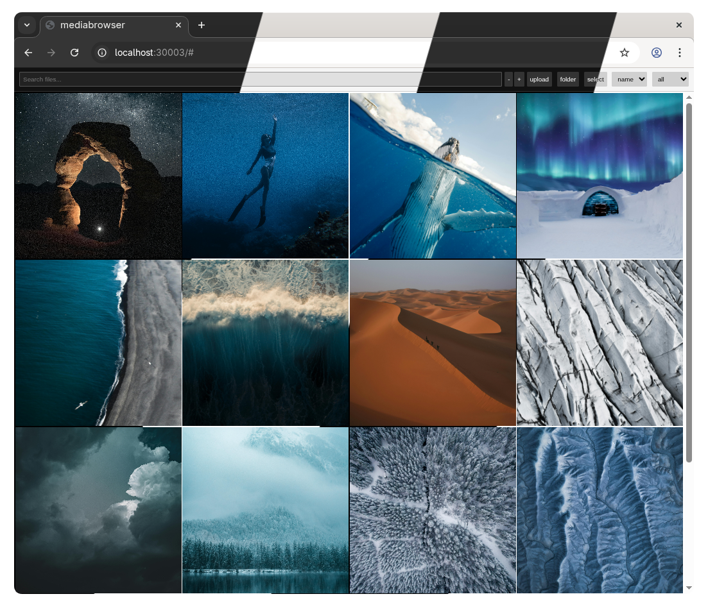

<h3 align="center">
    A simple, lightweight file server
</h3>

<div align="center">
	
</div>

## Usage

### Run

```sh
cargo run
```

The default build enables `api` and `ui` over HTTP. Enable other combinations with
Cargo features; see the [feature documentation](./docs/features/).

```sh
# All features, including authentication, HTTPS, CORS, and firewall
cargo run --all-features

# Release build
cargo build --locked --release
```

The server listens on `127.0.0.1:30003`. Set `BIND_ADDR` and `PORT`.

For containers: `docker compose --profile pro up --build`.

See the [endpoint documentation](./docs/endpoints/) for details.

## Security and HTTP Behavior

`DATA_DIR` is the trusted filesystem anchor. Symbolic links below it are hidden
from listings and searches.
Direct paths to a link, or through one, behave as missing paths. Recursive copy
and download skip links; moving or removing a real directory may move or remove
link entries contained by that directory, but their targets are never followed.

Enable the optional [`auth` feature](./docs/features/auth.md) for directory-based
accounts, a `/login` page, private user homes, and sessions held only in memory.
Accounts are provisioned in `.home/<username>/`, with `.root/` for `root`.
The first login sets the password when the account has no `.shadow` file.
Root can access all files in the mounted data directory, including `.shadow` files.
Visit `/logout` to end the current session.
Visit `/password` to change your password and invalidate your other sessions.
Without `auth`, there is no login or account access control.

UI and HTTPD directory paths end with `/`. A missing trailing slash on a
directory is redirected to its canonical path. The UI obtains regular files through
`POST /api/cat`; unsupported media is displayed as the endpoint response.

The UI response is stored and served as gzip. Browsers negotiate this
automatically. Other clients can request and decompress it with:

```bash
curl --compressed http://localhost:30003/ui/
```

A client that explicitly rejects gzip receives `406 Not Acceptable`.

## TODO

- Text file editing (?)
